# FASAL Backend Design

In-depth design of the FASAL backend (the `fasal/` package): the data flow, the two ingestion
paths, and **what every module and function does**. Diagrams are Mermaid (render on GitHub and most
viewers). Companion to [`02-system-architecture.md`](02-system-architecture.md) (targets/stack),
[`science.md`](science.md) (the physics), and [`04-ai-ml-modeling-plan.md`](04-ai-ml-modeling-plan.md).

> **Reminder of the product contract:** FASAL outputs a **risk** screening — class + calibrated
> score + confidence + reason codes + a safety-first action — never a certification. Lab methods are
> the truth.

## Contents
1. [Layered architecture](#1-layered-architecture)
2. [Module dependency graph](#2-module-dependency-graph)
3. [Data contracts (the 8 objects + output contract)](#3-data-contracts)
4. [Primary path — Avantes point spectrometer](#4-primary-path--avantes-point-spectrometer)
5. [Secondary path — imaging cube](#5-secondary-path--imaging-cube)
6. [Module-by-module reference (every functionality)](#6-module-by-module-reference)
7. [Decision logic (score → class → action, confidence, OOD)](#7-decision-logic)
8. [End-to-end sequences](#8-end-to-end-sequences)
9. [Reproducibility & provenance](#9-reproducibility--provenance)
10. [Configuration & extension points](#10-configuration--extension-points)
11. [Testing map](#11-testing-map)

---

## 1. Layered architecture

Acquisition → science → features → ML → services → interface, over a foundation of contracts and
config. The **Avantes point path is primary**; the imaging-cube path is retained for a future imager.

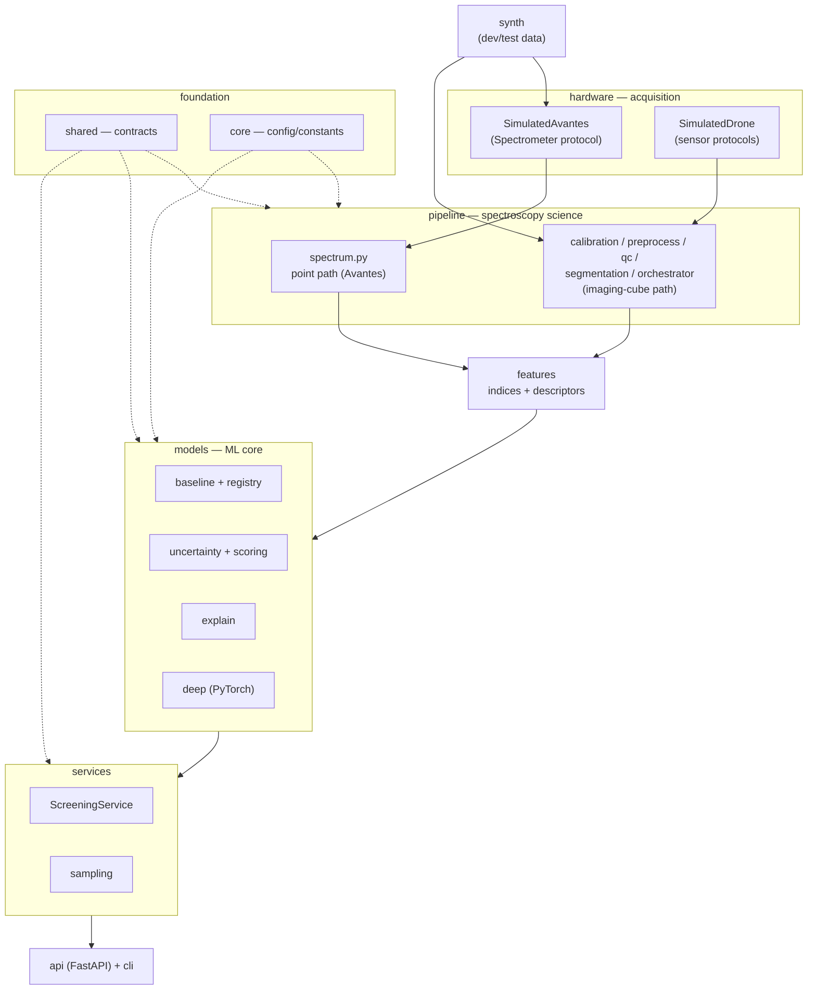

| Layer | Package | Responsibility |
|---|---|---|
| Acquisition | `hardware` | Sensor/drone protocols + simulated drivers (counts vs pixel; cubes) |
| Science | `pipeline` | counts→reflectance (point) and raw-cube→reflectance (imaging) + preprocessing |
| Features | `features` | Vegetation/red-edge/water indices + descriptors (the science→ML bridge) |
| ML core | `models` (+ `models.deep`) | Baselines, deep models, uncertainty/OOD, score calibration, explainability |
| Services | `services` | `ScreeningService` (cube/spectra/avantes) + sample-plan generation |
| Interface | `api`, `cli` | Thin FastAPI surface + CLI demos (light this phase) |
| Foundation | `shared`, `core` | The 8 data objects + output contract; config, constants, logging |
| Dev data | `synth` | Synthetic spectra/cubes so the whole stack runs without real captures |

## 2. Module dependency graph

The graph is **acyclic and one-directional** (acquisition → … → interface). `features` never imports
`pipeline` (indices are self-contained), which keeps `pipeline.segmentation → features.indices` safe.

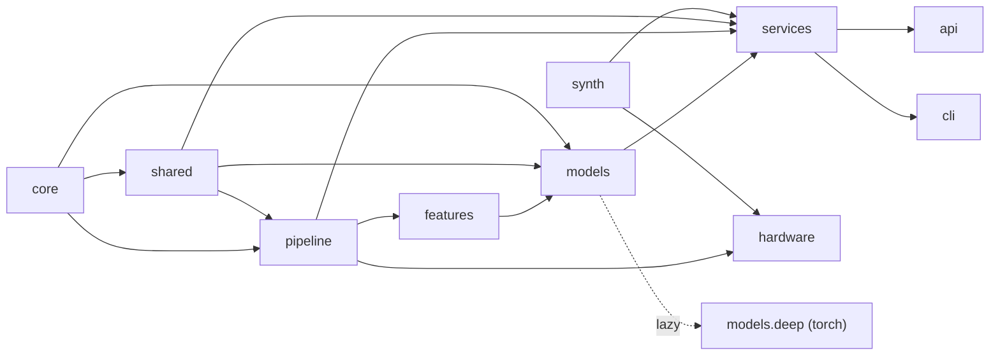

## 3. Data contracts

### 3.1 The 8 core data objects (`fasal/shared/schemas.py`)
They connect **drone/sensor data → field context → lab truth**.

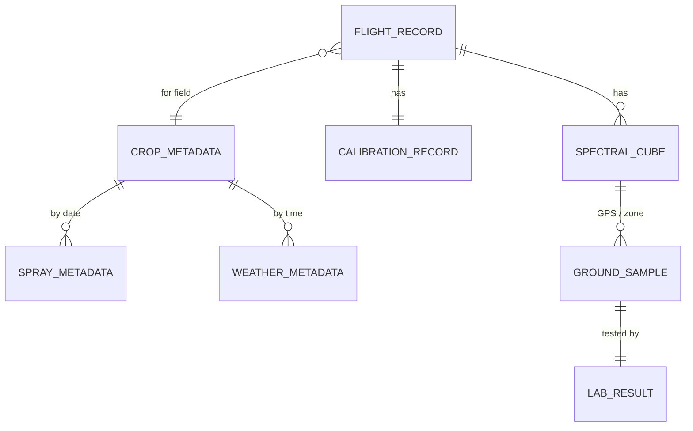

Plus instrument records (Avantes): `SpectrometerSpec`, `AcquisitionSettings`, `Filter`,
`FieldOfView`, `WavelengthCalibrationSpec`; `CalibrationRecord` carries `integration_time_ms` +
`filter_name`.

### 3.2 The risk output contract (`fasal/shared/outputs.py`)

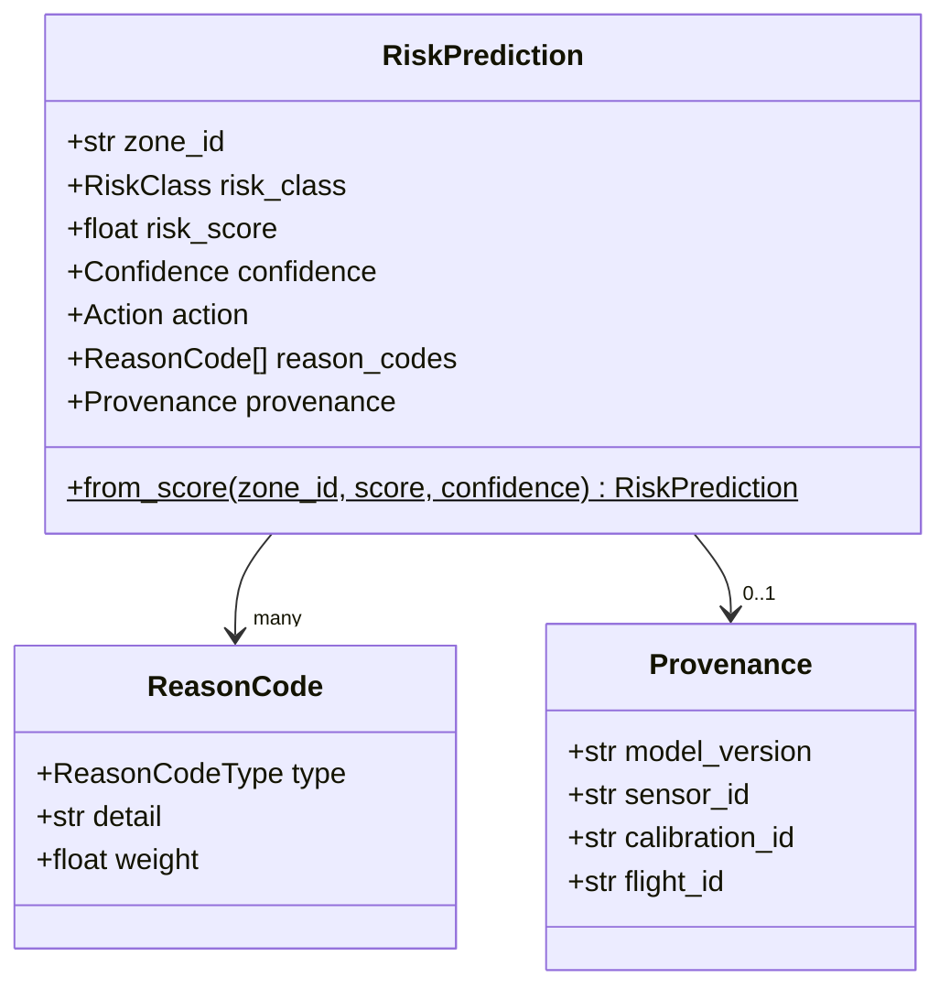

`RiskPrediction.from_score(...)` is the single constructor that derives `risk_class` (thresholds)
and `action` (safety-first routing) from the contract — so UI, API, and services never drift (§7).

## 4. Primary path — Avantes point spectrometer

The Avantes emits **counts vs detector pixel**. `fasal/pipeline/spectrum.py` turns that into
model-ready reflectance; the result feeds the **same** features/models as the imaging path.

Reflectance is **integration-time invariant**: `ρ = (sample−dark)/(white−dark)·ρ_white`, with each
acquisition divided by its own integration time so different exposures are comparable. Each scan
covers a **FOV footprint** (`2·d·tan(FOV/2)`), so a field "map" is many **geo-tagged point scans**
(sparse), not a raster.

## 5. Secondary path — imaging cube

`ReflectancePipeline.run` composes the imaging stages (source-doc Figure 4).

## 6. Module-by-module reference

Every public functionality, grouped by package.

### 6.1 `core` — configuration, constants, logging
| Item | Signature | Purpose |
|---|---|---|
| `Settings` | pydantic-settings (`FASAL_` env) | env/dirs, DB/storage defaults, spectrometer params, seed |
| `get_settings()` | `-> Settings` | cached settings accessor |
| `constants` | module | wavelength regions, diagnostic bands, SG defaults, risk/confidence thresholds, Avantes defaults |
| `get_logger(name)` | `-> Logger` | stderr logger (idempotent) |

### 6.2 `shared` — contracts
| Item | Purpose |
|---|---|
| `RiskClass` | low/medium/high; `from_score(score)` thresholds |
| `Confidence` | high/uncertain/ood |
| `Action` | clear/collect_sample/close_range_scan/send_to_lab; `recommend(risk, confidence)` |
| `Modality`, `LabMethod`, `ReasonCodeType` | controlled vocabularies |
| 8 data objects | `FlightRecord, SpectralCube, CalibrationRecord, CropMetadata, SprayMetadata, WeatherMetadata, GroundSample, LabResult` |
| instrument records | `SpectrometerSpec, AcquisitionSettings, Filter, FieldOfView, WavelengthCalibrationSpec` |
| outputs | `RiskPrediction (from_score), ReasonCode, Provenance, SamplePlan, SamplePlanPoint` |

### 6.3 `pipeline.spectrum` — Avantes point path (counts → reflectance)
| Function / class | Signature | Purpose |
|---|---|---|
| `WavelengthCalibration` | `.wavelengths(n)`, `.pixel_to_wavelength(p)`, `.linear(n,lo,hi)`, `.avantes_vnir_default(n)` | pixel→wavelength polynomial (Avantes) |
| `RawSpectrum` | `counts, integration_time_ms, filter_name, dark_counts` | raw counts-vs-pixel + acquisition settings |
| `PointSpectrum` | `reflectance, wavelengths, meta` | calibrated output |
| `dark_correct(counts, dark)` | `-> ndarray` | subtract dark |
| `per_millisecond(counts, it)` | `-> ndarray` | normalize counts to counts/ms |
| `counts_to_reflectance(sample, white, dark)` | `-> ndarray` | same-integration-time reflectance |
| `calibrate_raw(sample, white, dark, calibration)` | `-> PointSpectrum` | full chain incl. integration-time + filter |
| `apply_filter(wl, values, passband)` | `-> (values, wl, mask)` | mask to filter passband |
| `fov_footprint_diameter(fov_deg, distance_m)` | `-> float` | ground footprint of a scan |

### 6.4 `pipeline` — imaging-cube science
| Module | Key items | Purpose |
|---|---|---|
| `cube` | `HSICube` (`band_at`, `to_2d`, `with_data`…), `nearest_band_index` | immutable (H,W,B) container |
| `calibration` | `two_point_reflectance`, `empirical_line_fit`, `apply_empirical_line`, `normalize_by_irradiance`, `calibrate_cube` | DN→reflectance |
| `preprocess` | `savitzky_golay`, `derivative`, `snv`, `msc`, `resample`, `good_band_mask`, `remove_bad_bands` | spectral preprocessing (recipe below) |
| `qc` | `compute_qc` → `QCResult`; `saturation_valid`/`shadow_valid`/`highlight_valid`/`brightness` | validity masks + coverage |
| `segmentation` | `NDVISegmenter`, `vegetation_mask`, `Segmenter` (Protocol) | canopy/fruit isolation |
| `orchestrator` | `PipelineConfig`, `PipelineResult`, `ReflectancePipeline.run`, `preprocess_spectra` | compose the path; lockable recipe |

The **preprocessing recipe** (`preprocess_spectra`, shared by training and inference):

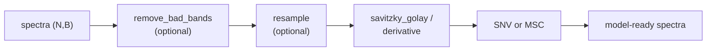

### 6.5 `features` — science → ML bridge
| Function | Returns | Purpose |
|---|---|---|
| `ndvi`, `ndre`, `water_band_index` | reduces band axis | normalized-difference indices |
| `red_edge_position` | nm of max 1st-derivative in red-edge | stress indicator |
| `index_features(arr, wl)` | `(…,K)`, names | stack indices |
| `band_statistics`, `derivative_stats` | `(N,k)`, names | descriptors |
| `build_feature_matrix(spectra, wl)` | `(N,K)`, names | interpretable feature matrix (NaN→0) |
| `fit_pca(spectra, n)` | scores, fitted PCA | dimensionality reduction |

> Models train on the **preprocessed spectra** (chemometric standard); engineered features are the
> interpretable/auxiliary representation used for explainability.

### 6.6 `synth` — synthetic data
| Function | Purpose |
|---|---|
| `vegetation_template(wl)` / `soil_template(wl)` | plausible reflectance curves (red-edge, water dips) |
| `default_wavelengths()` | VNIR grid (450–995 nm @ 5 nm) |
| `make_dataset(n, wl, signal_strength, …)` | labelled spectra with a deliberately weak risk signal |
| `make_cube(h, w, wl, …)` | synthetic cube + vegetation/risk maps |

### 6.7 `models` — ML core
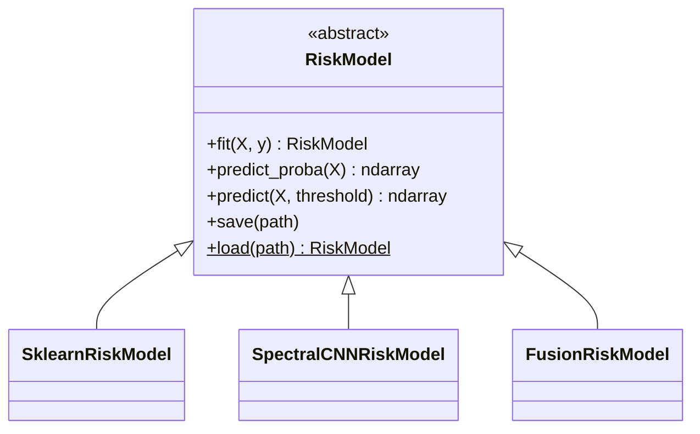

| Module | Items | Purpose |
|---|---|---|
| `base` | `RiskModel` (ABC) | uniform fit/predict_proba/predict/save/load |
| `baseline` | `SklearnRiskModel`, `random_forest`, `gradient_boosting`, `svm`, `pls_da` | Stage-0 baselines (StandardScaler + estimator) |
| `registry` | `register`, `create(name)`, `available()` | name→model; `cnn1d`/`fusion` registered **lazily** (torch only on use) |
| `uncertainty` | `assign_confidence`, `margin_confidence`, `confidence_from_samples`, `MahalanobisOODDetector` | confidence + OOD routing |
| `scoring` | `ScoreCalibrator` (isotonic/sigmoid) | calibrate raw scores → comparable risk scores |
| `explain` | `feature_importance`, `band_importance`, `region_for_wavelength`, `reason_codes_from_bands`, `build_reason_codes` | wavelength importance → science-grounded reason codes |

### 6.8 `models.deep` — PyTorch (extra `fasal[deep]`)
The fusion architecture (source-doc Figure 8); branches are optional and use dropout (no BatchNorm)
for clean MC-dropout uncertainty.

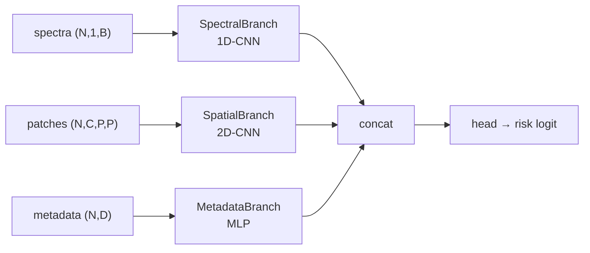

| Item | Purpose |
|---|---|
| `Spectral1DCNN`, `SpectralCNNRiskModel` | 1D-CNN over spectra; `predict_proba_samples` = MC-dropout |
| `FusionModel`, `FusionRiskModel` | spectral+spatial+metadata fusion; `X` may be a dict |
| `SpectraDataset`, `FusionDataset`, `train_loop` | data + BCEWithLogits training loop |
| `build_model(kind)` | factory used by the registry |

### 6.9 `hardware` — acquisition
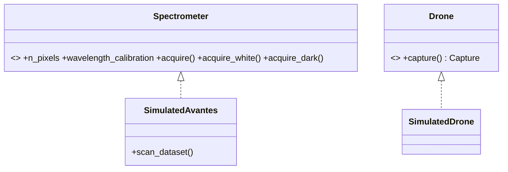

| Item | Purpose |
|---|---|
| Protocols: `Spectrometer, Drone, SpectralSensor, RGBCamera, GNSS, IrradianceSensor` | structural hardware contracts |
| `Capture` | cube + RGB + location + irradiance + records |
| `SimulatedAvantes` | emits counts-vs-pixel (lamp + dark + integration-time scaling + noise); `acquire/acquire_white/acquire_dark/scan_dataset` |
| `SimulatedDrone` + sensors | imaging-cube capture for the secondary path |

### 6.10 `services`, `db`, `storage`, `api`, `cli`
| Item | Purpose |
|---|---|
| `ScreeningService.screen_avantes(...)` | calibrate raw Avantes → reflectance → screen (primary) |
| `ScreeningService.screen_spectra(...)` | screen point reflectance → `PointScreeningResult` |
| `ScreeningService.screen_cube(...)` | imaging-cube → `ScreeningResult` (+ risk_map) |
| `ScreeningConfig` | pipeline recipe + `field_quantile` (high-recall) + `model_version` |
| `build_sample_plan` / `build_sample_plan_from_points` | targeted low/med/high sampling points |
| `InMemoryRepository` (`db`) | repository pattern (Postgres/PostGIS later) — light |
| `LocalObjectStore` (`storage`) | filesystem object store (S3/MinIO later) — light |
| `api` | FastAPI: `/health`, `/models`, `/screen/synthetic` |
| `cli` | `fasal version`, `fasal demo`, `fasal demo-avantes` |

## 7. Decision logic

### 7.1 score → `RiskClass` (`RiskClass.from_score`)
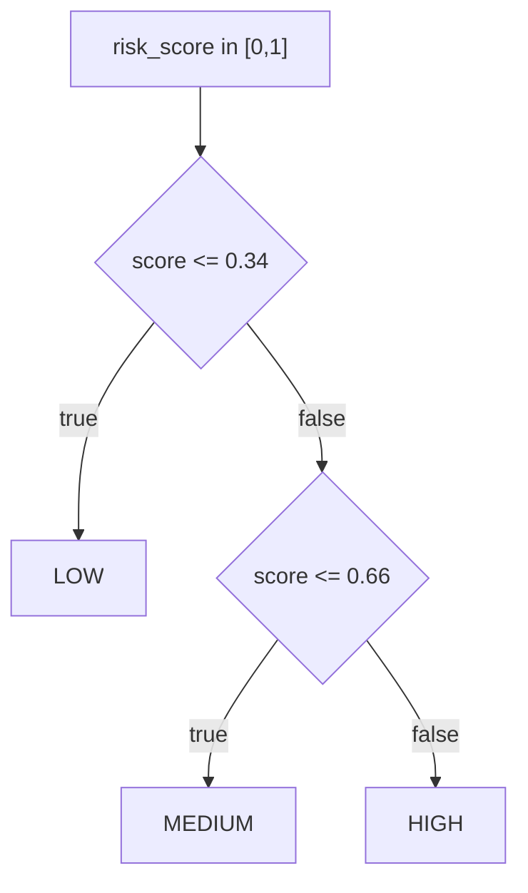

### 7.2 confidence assignment (`assign_confidence`)
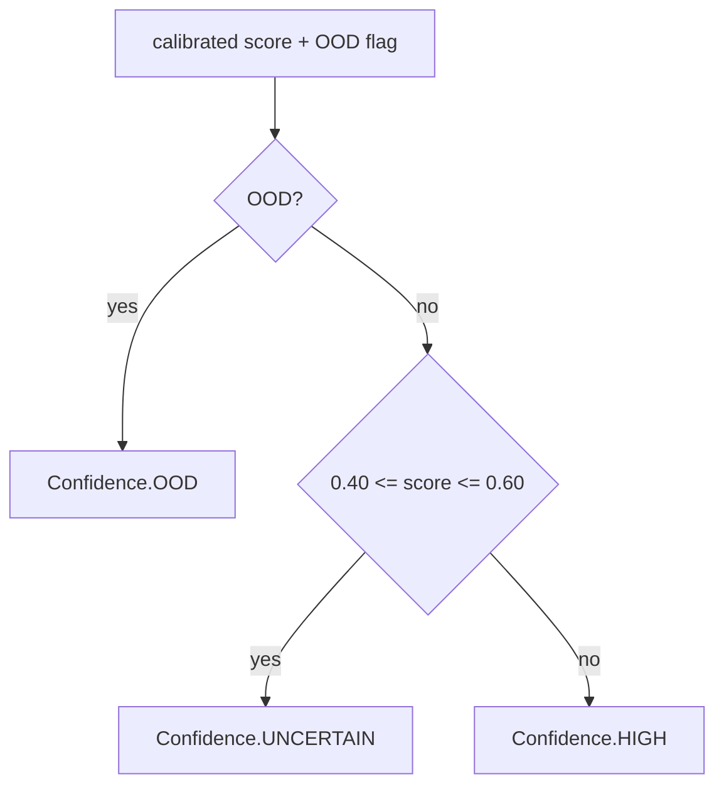

### 7.3 (class, confidence) → `Action` (`Action.recommend`) — safety-first
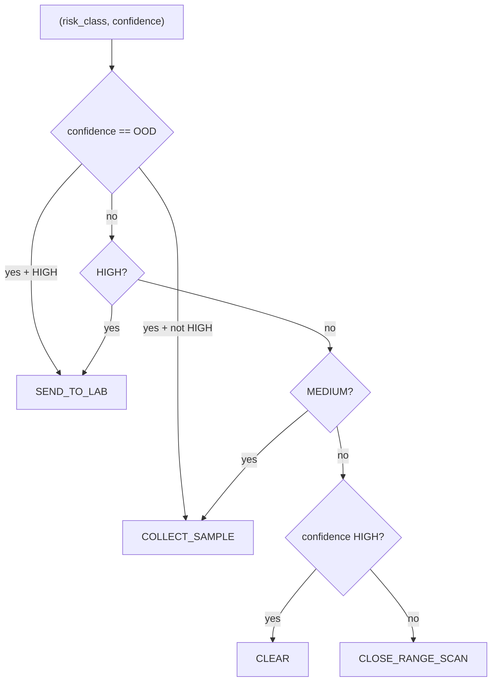

| | LOW | MEDIUM | HIGH |
|---|---|---|---|
| **HIGH conf** | CLEAR | COLLECT_SAMPLE | SEND_TO_LAB |
| **UNCERTAIN** | CLOSE_RANGE_SCAN | COLLECT_SAMPLE | SEND_TO_LAB |
| **OOD** | COLLECT_SAMPLE | COLLECT_SAMPLE | SEND_TO_LAB |

## 8. End-to-end sequences

### 8.1 Avantes scan → screening (primary)
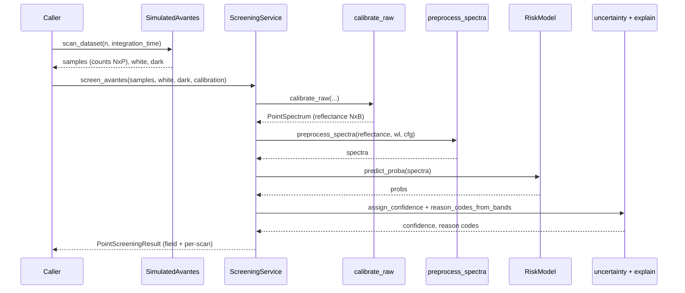

### 8.2 Imaging cube → screening (secondary)
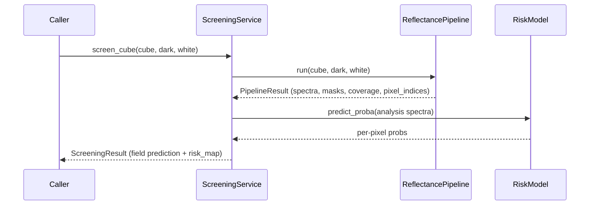

### 8.3 Training (synthetic, parity-preserving)
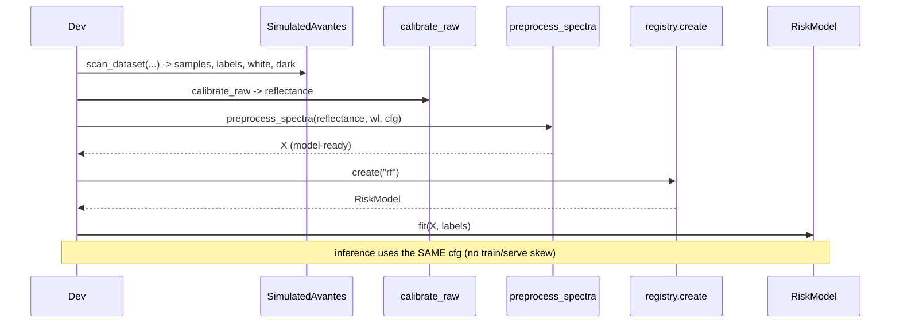

### 8.4 API request `/screen/synthetic`
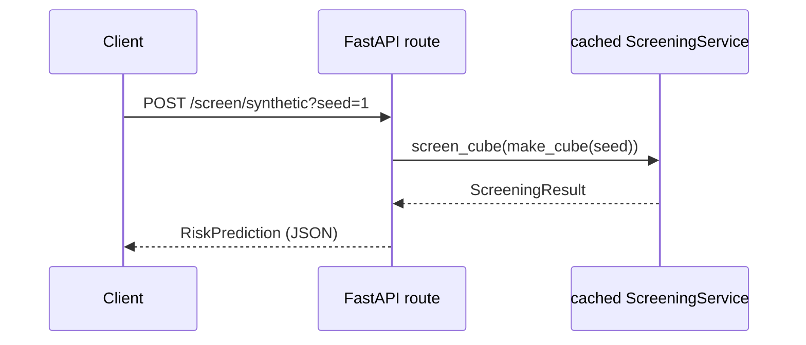

## 9. Reproducibility & provenance

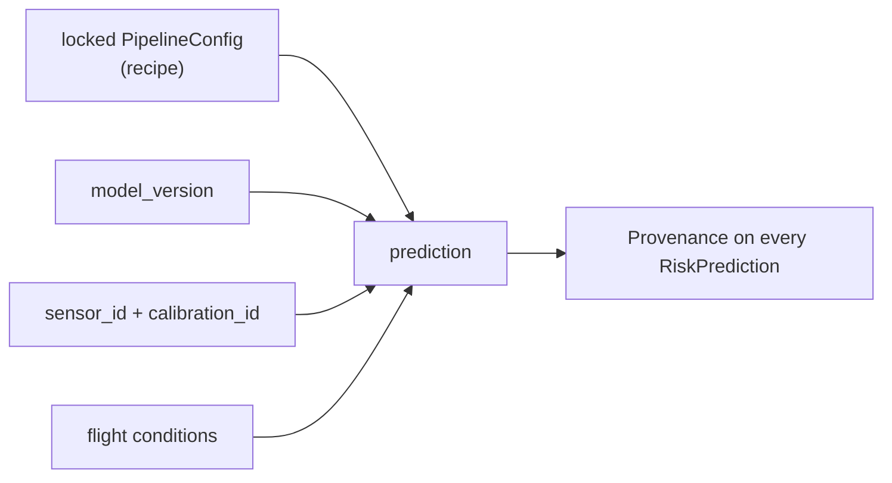

- **Preprocessing is locked before validation** (`PipelineConfig`); training and inference share it
  via `preprocess_spectra` — no train/serve skew.
- Every `RiskPrediction` can carry `Provenance` (model version, sensor, calibration, flight) for audit.
- Production target adds **DVC** (dataset versions) + **MLflow** (runs/model registry) — see
  [`02`](02-system-architecture.md), [`03`](03-data-architecture-governance.md).

## 10. Configuration & extension points

| To change… | Do this | Why it's easy |
|---|---|---|
| Avantes calibration / FOV / filters | set `FASAL_*` env or `SpectrometerSpec` / `WavelengthCalibration` | values are configurable; linear default is a placeholder |
| Model | `registry.create("rf"\|"pls-da"\|"cnn1d"\|"fusion")` | all behind `RiskModel` |
| Add a new model | implement `RiskModel`, `register("name")(factory)` | registry is open |
| Real DB / object store | implement `Repository` / `ObjectStore` | services depend on the interface |
| Real hardware | implement the `Spectrometer` / `Drone` protocols | screening is sensor-agnostic |
| Deep models | `pip install "fasal[deep]"` | torch is import-guarded; core unaffected |

## 11. Testing map

`* test_deep` is skipped unless `fasal[deep]` (torch) is installed. Run: `pytest --cov=fasal`.
Science/ML/services modules are 90–100% covered; deep modules are covered under the `deep` extra.

---

*See [`README.md`](../README.md) for quickstart, [`science.md`](science.md) for the physics, and
[`02-system-architecture.md`](02-system-architecture.md) for the production stack and targets.*
